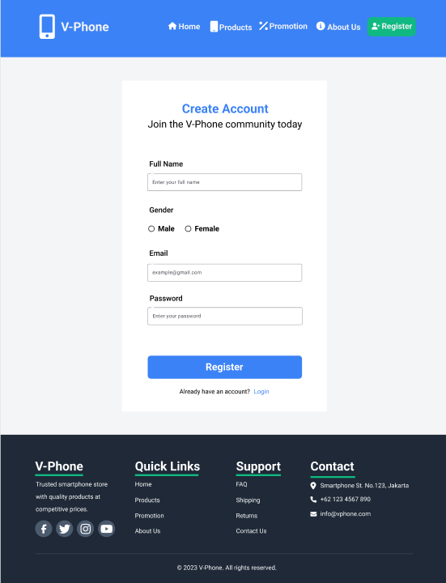
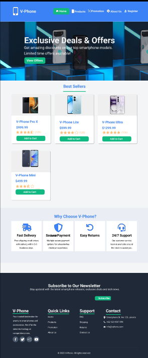
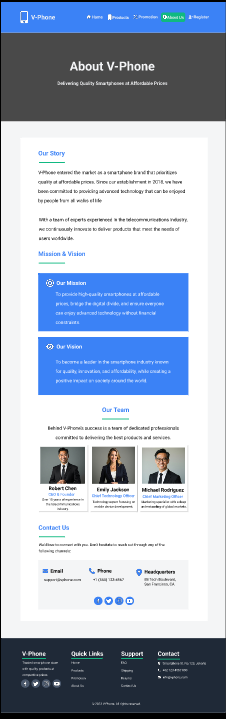
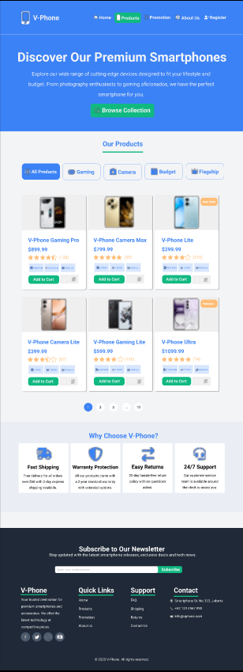

# 📱 Figma Web Design – Smartphone Brand Landing Page

Welcome to the **Figma Web Design Project** – a concept landing page for a fictional smartphone brand. Designed with care using **Figma**, this UI project delivers a clean, modern, and interactive user experience for showcasing smartphone products. 🎨📱

---

## 🖼️ Project Overview

This project is a **UI/UX simulation** for a smartphone e-commerce website.  
It includes multiple pages with cohesive branding, consistent layouts, and functional flows – perfect for prototyping, testing, or pitching ideas! 🚀

---

## 📁 Files

- `📄 Figma Phone Web.fig` – The main design file (Figma format)

---

## 🧭 Pages Included

### 1. 📝 **Register Page**
- Simple and elegant user registration form.

### 2. 🏠 **Home Page**
- Showcases **Best Seller smartphones** 📲  
- Section: **Why Choose Our Brand** 💎

### 3. 👥 **About Us Page**
- Tells the brand story  
- Shares vision and mission 🎯 
- Team member profiles 🤝 
- **Contact Us** section 📩

### 4. 📦 **Product Page**
- Displays a list of smartphone products  
- Includes **Add to Cart** functionality simulation 🛒

### 5. 🎉 **Promotion Page**
- Highlights ongoing **Flash Sales** ⚡  
- Current promotions and how to redeem them  
- Includes an **FAQ** section to address common user questions ❓

---

## 🎯 Design Goals

- ✨ Present a professional and attractive landing page concept  
- 🤖 Simulate a modern e-commerce experience  
- 📱 Ensure the design is **responsive** and **user-friendly**  
- 🔄 Provide clean navigation flows and CTA structure

---

## 🔗 Figma Prototype

👉 [View the live prototype here](https://www.figma.com/design/mNFkYNuGdHcBiQWADTpseM/Figma-V-Phone-Web?node-id=417-725&m=dev&t=gf6uKr8vNwmN7JF3-1)

Feel free to duplicate or inspect the design!

---

## ✨ Preview Snapshot

## 🤝 Let's Connect!

Questions, ideas, or feedback? Feel free to reach out!

- 💌 Linktr.ee: https://linktr.ee/qonitaqq
---

> *“Design is the silent ambassador of your brand.”* – Paul Rand 🖌️
> 
---

Thanks for visiting! Don’t forget to ⭐️ the repo if you find it useful!
